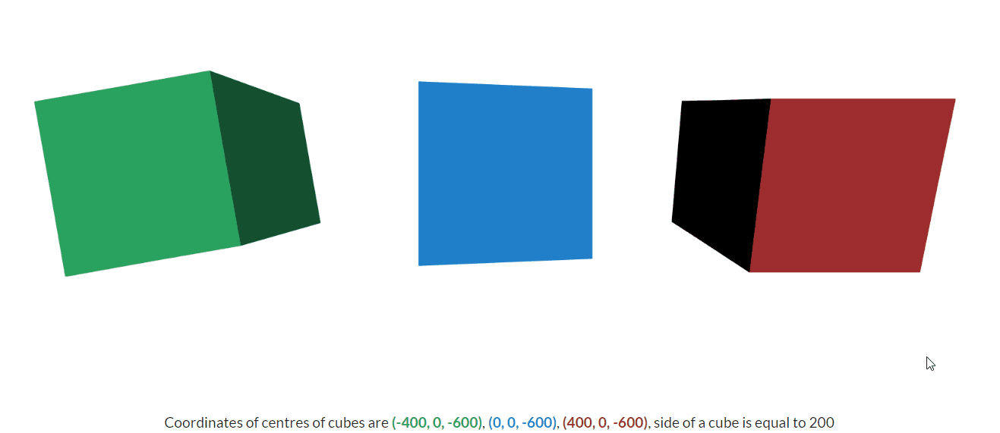

# Webgl camera imitation
Report for observing basic concepts of working with camera in WebGL. This includes:
* introduction with description of the main logical types of coordinates in webgl
* prooves for matrix which is being used for creation of perspective effect
* prooves for matrix designed for keeping an eye on some point in space
* demonstration of described techniques

